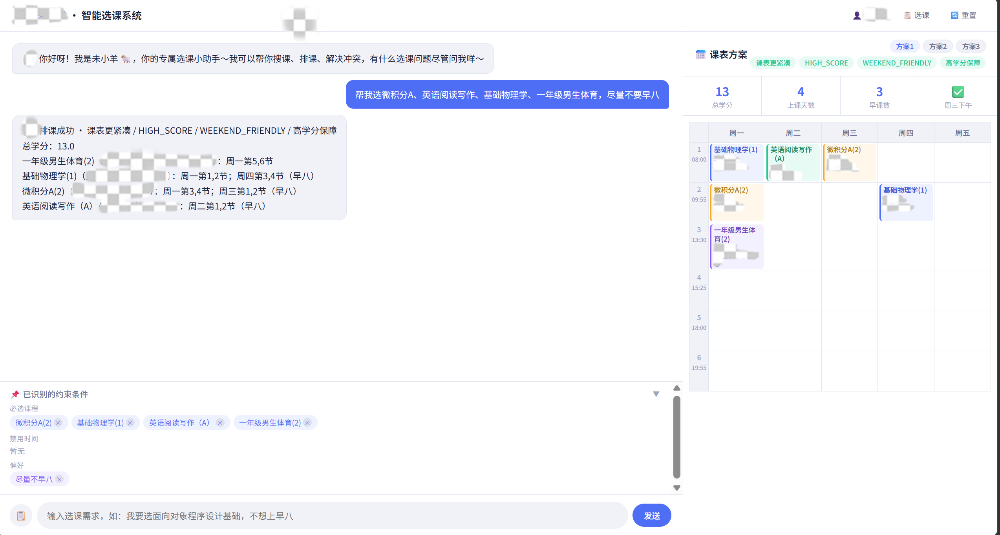

# Wen Dao Wei Yang 🐏

[简体中文](README.md) | [English](README_EN.md)


### THU Course Pilot · Qinghe Studio

> 🏆 Second Prize, Creative Track, 3rd “Wei Yang City” Intelligent Agent Competition

Wen Dao Wei Yang is an AI-assisted university course scheduling project. Users describe desired courses, unavailable time slots, and preferences in natural language. The system searches the course catalog, extracts constraints, detects conflicts, and generates candidate timetables.

> **Project status:** This repository preserves a completed competition project for demonstration and technical reference. It is not actively maintained, does not provide an online service, and is not planned for production deployment.

This is a student team competition project. It is **not** an official course selection system of Tsinghua University or Weiyang College.

## Demo



The screenshot uses virtual demo data. Teacher names, locations, user information, and the former mascot artwork have been obscured.

## Features

- Add, remove, and inspect courses through natural-language conversation.
- Interpret time constraints such as “no 8 a.m. classes” and “Wednesday afternoon is available.”
- Express preferences for teachers, locations, and class periods.
- Detect course conflicts and let the user decide which course to keep.
- Generate and compare multiple candidate timetables.
- Display total credits, class days, and morning-class counts.

## Architecture

```text
FastAPI API (main.py)
  └─ LLM Agent (src/llm_agent.py)
       ├─ Session Manager
       ├─ Three-phase Scheduler
       ├─ Data Adapter and bitmask collision detection
       └─ SQLite virtual demo data
```

The front end is a single-page application built with vanilla HTML, CSS, and JavaScript in `static/index.html`.

## Requirements

- Python 3.10+
- DeepSeek, Moonshot, or another OpenAI SDK-compatible model endpoint
- A local virtual demo database named `scheduler.db`

## Data Policy

Real course data used during the competition is not part of this public repository and will not be published.

Development and demonstrations rely on locally prepared virtual data. The database, raw course records, and generated intermediate files are excluded through `.gitignore`. Do not commit real course data, personal information, or API credentials.

To initialize a database from your own authorized data, prepare:

- `data/raw_courses.jsonl`
- `output/position_slot_map.json`
- optionally, `data/curriculum.json`

Then run `python init_db.py`.

## Local Setup

With a virtual `scheduler.db` already prepared:

```powershell
python -m venv .venv
.\.venv\Scripts\Activate.ps1
python -m pip install -r requirements-lock.txt

Copy-Item .env.example .env
# Edit .env and provide your own LLM_API_KEY.

python main.py
# Open http://localhost:8000
```

Never commit `.env` or expose an API key in logs, screenshots, or public issues.

## Tests

```powershell
python -m pytest tests/ -q
```

As of July 12, 2026, the baseline consists of 97 passing tests. They cover course search, session state, all three scheduling phases, Agent tools, shortcuts, conflict detection, and API scenarios. The default test suite does not call a real LLM endpoint.

## Model Configuration

| Variable | Description |
|---|---|
| `LLM_API_KEY` | Model endpoint credential |
| `LLM_BASE_URL` | Compatible endpoint URL; defaults to `https://api.deepseek.com` |
| `LLM_MODEL` | Model name; defaults to `deepseek-chat` |

See `.env.example` for an example configuration.

## Team

Developed by **Qinghe Studio**:

[@brightcolin](https://github.com/brightcolin) · [@YangAn8800](https://github.com/YangAn8800) · [@sayankk](https://github.com/sayankk) · [@rainlanelongings-cmd](https://github.com/rainlanelongings-cmd)

## Copyright

This repository does **not** include an open-source license. Public visibility does not grant permission to copy, modify, redistribute, or commercially use the project. Contact the project team and the relevant rights holders before quoting, presenting, or building upon this work, and retain attribution to the original project and team.

Third-party platform, model, university, and competition names and marks remain the property of their respective rights holders.
